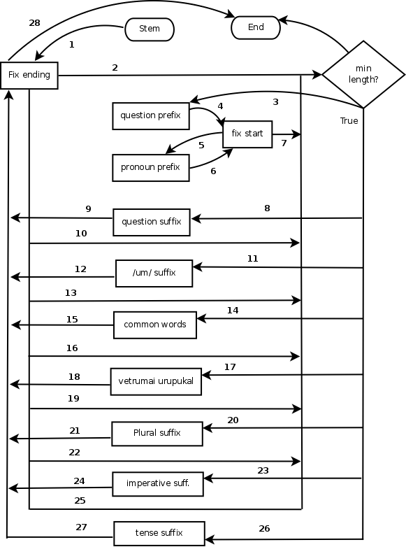

# Stemming Algorithm

In Tamil suffixes are used for many things like tense, plurality, person etc. So the suffixes are grouped into categories and a routine is defined for each category to handle the removal the respective suffixes. After removal of suffix for each category there is routine to fix or recode the ending of the word to make it consumable for the next routine. Also before stripping the suffix every routine checks for the current size of the string. The flow of the algorithm is depicted in the above figure.

As shown in the figure, first the prefixes are removed followed by the suffixes. Every suffix stripping routine checks for the length of the string before proceeding and after removing a suffix calls the routine responsible for fixing the endings

## Prefix Removal
There are two routines in the algorithm to handle prefixes. One is for handling the prefix in the questions. Eg. எக்காலம் (which period?). - காலம். Another one is for removing the pronoun prefixes, அ, இ and  உ.Eg. அக்காலம்(that period).- காலம்

After removing the prefixes another routine handles fixing the start of the word. The above prefixes introduce வ் when the root word starts with a vowel. வ in the start of the word cannot combine with certain vowels. In such cases this routine substitutes with appropriate vowel as the starting.

## Fixing the ending
When a suffix joins a root word one of the following can happen
1. New letters are introduced
2. Some letters are removed
3. The letters are transformed
4. Joins naturally without addition/removal
fix_ending routine tries to handle these modifications before the next suffix removal routine is called. 

If the join had caused new letters to be introduced, this routine removes it. For example vallinam consonants appear as conjunctions in many cases. A normal word will not end with a vallinam consonant.

<table border="1">
<tr><td>கடக்க</td><td>கடக்</td><td>கட</td></tr>
<tr><td>original word</td><td>suffix stripped</td><td>vallinam consonant removed</td></tr>
</table>

If the join has caused some characters to be removed it leaves it since it is possible for more than one valid character to be appropriate candidates.

If the join has transformed some of the characters it tries to recode it. It currently cannot recover all such transformations. Eg.

<table border="1">
<tr><td>மரத்தின்</td><td>மரத்த்</td><td>மரம்</td></tr>
<tr><td>original word</td><td>suffix removed</td><td>end recoded</td></tr>
</table>

The fix_ending removes the conjunctions and recodes the transformed letters.

## Suffix removal
The stemming algorithm handles different kinds of suffixes. They are discussed in the following sections

### Question suffixes
This routine removes the suffixes. The suffixes are ஆ, ஏ, ஓ. 
<table border="1">
<tr><td>கண்ணனா</td><td>கண்ணன்</td></tr>
<tr><td>Is it Kannan</td><td>Kannan</td></tr>
</table>

### Conjunction suffix
This routine removed the suffix உம்

<table border="1">
<tr><td>அவனும்</td><td>அவன்</td></tr>
<tr><td>Him and</td><td>Him</td></tr>
</table>

### Common words
This algorithm tries to remove some of the common words that are attached to verbs or nouns. These are not suffixes and are proper words.

<table border="1">
<tr><td>அவனில்லாத</td><td>அவன்</td></tr>
<tr><td>without him</td><td>Him</td></tr>
</table>

### Case suffixes
Tamil case suffixes are attached to the ends of nouns to express grammatical relations (e.g., subject, direct object, etc.) as well as meanings typically expressed in English through pre-positions (e.g., 'in', 'to', 'for', 'from', etc.).  

<table border="1">
<tr><td>அவனிடம் (with him)</td><td>அவன் (him)</td></tr>
<tr><td>மரத்தில் (in tree)</td><td>மரம் (tree)</td></tr>
</table>

### Plural suffix
The plural suffix in Tamil is கள்.
<table border="1">
<tr><td>மரங்கள்</td><td>மரம்</td></tr>
<tr><td>Trees</td><td>Tree</td></tr>
</table>

### Imperative suffixes
These are used to command a person.

<table border="1">
<tr><td>காண்பி (show me)</td><td>காண் (see)</td></tr>
</table>

### Tense suffixes
This routine removes tense indicating suffixes. It also include person suffixes.

<table border="1">
<tr><td>பிரிகின்றன (leaving)</td><td>பிரி (leave)</td></tr>
</table>

Apart from the standard suffixes the routine also removed கொண்டு and similar words.

## Minimum length criteria
Being a strong stemmer it has a tendency to overstem some words to single letters. To prevent this every routine checks for the length of the string. Currently the minimum length is set as 4 characters. These are not 4 characters exactly since in Unicode a meaningful character can be represented by more than one code points. So the check made in the implementation actually only verifies the number of codepoints in the string than the actual meaningful characters. Also the routine which fixes the ending does not check for the length of the string. So it is still possible to get a stem of length one character.

